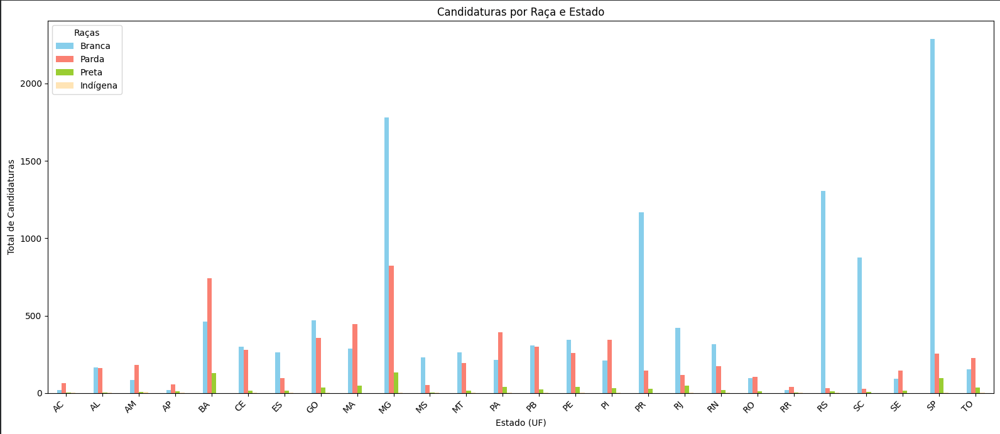
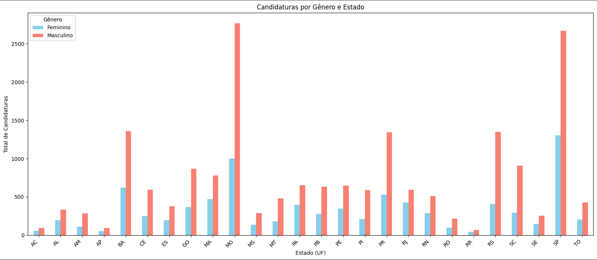

# 🗳️ Análise de Candidaturas nas Eleições Municipais de 2020

## 📋 Sobre o Projeto

Este projeto realiza uma análise exploratória dos dados de candidaturas nas **eleições municipais brasileiras de 2020**, com foco na representatividade de **gênero** e **raça/cor** entre os candidatos.

O objetivo central é evidenciar as disparidades de representação política no Brasil, demonstrando como **homens brancos** ainda dominam de forma expressiva o cenário eleitoral, enquanto grupos historicamente marginalizados — como mulheres, pessoas pardas, pretas e indígenas — seguem sub-representados nas disputas eleitorais.

---

## 🎯 Motivação

A democracia representativa pressupõe que a composição dos candidatos reflita a diversidade da sociedade. No entanto, os dados das eleições municipais de 2020 revelam um cenário preocupante:

- **Candidatos brancos** representam a larga maioria das candidaturas, mesmo sendo o Brasil um país de maioria parda e preta segundo o IBGE.
- **Candidatos masculinos** superam em mais de **6x** o número de candidaturas femininas, evidenciando barreiras estruturais à participação política das mulheres.
- Candidaturas de pessoas **indígenas** são expressivamente raras, refletindo o apagamento histórico dessas populações nos espaços de poder.

---

## 📊 Gráficos

### Candidaturas por Raça

### Candidaturas por Gênero

---

## 🗂️ Arquivos do Repositório

| Arquivo | Descrição |
|--------|-----------|
| `candidaturas_raca_por_uf.csv` | Totais de candidaturas separados por raça/cor (BRANCA, PARDA, PRETA, INDÍGENA) |
| `candidaturas_genero_por_uf.csv` | Totais de candidaturas separados por gênero (feminino e masculino) |

---

## 📁 Fonte dos Dados

Os dados utilizados neste projeto são públicos e foram obtidos a partir do repositório:

- [`categorias-candidatas-prefeituras
`](https://github.com/nazareno/categorias-candidatas-prefeituras)

---

## 📌 Observações

- A análise considera apenas as raças **BRANCA, PARDA, PRETA e INDÍGENA**, excluindo categorias como "SEM INFORMAÇÃO" e "AMARELA" para manter o foco nas disparidades mais relevantes.
- Os dados cobrem municípios de todos os **26 estados** brasileiros.
